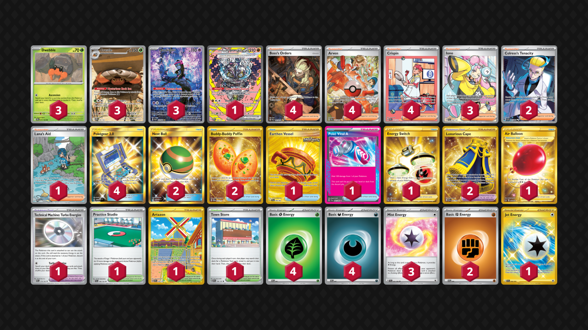

# Crustle

Tier **3** | Difficulty: **Hard** | Gameplan: **Stall**

**Source**: Greg Minklei - [Top 256 World Championships 2025](https://play.limitlesstcg.com/tournament/6846500e27d8bc24cf2514d3/player/dbforthewin/decklist)

## List
* 1 Cornerstone Mask Ogerpon ex PRE 160
* 3 Dwebble DRI 11
* 3 Munkidori SFA 72
* 3 Crustle DRI 186
* 1 Earthen Vessel SFA 96
* 4 Boss's Orders PAL 265
* 4 Arven PAF 235
* 1 Lana's Aid TWM 219
* 1 Practice Studio PAL 186
* 2 Nest Ball SUM 158
* 1 Air Balloon SSH 213
* 1 Poké Vital A SFA 62
* 1 Technical Machine: Turbo Energize PAR 179
* 1 Energy Switch SIT 212
* 1 Artazon OBF 229
* 1 Town Store OBF 196
* 2 Buddy-Buddy Poffin TWM 223
* 2 Colress's Tenacity SFA 87
* 3 Iono PAL 254
* 4 Crispin PRE 171
* 2 Luxurious Cape PAR 265
* 4 Pokégear 3.0 UNB 233
* 3 Mist Energy TEF 161
* 1 Jet Energy SSP 252
* 4 Basic {G} Energy SVE 1
* 4 Basic {D} Energy SVE 7
* 2 Basic {F} Energy SVE 6