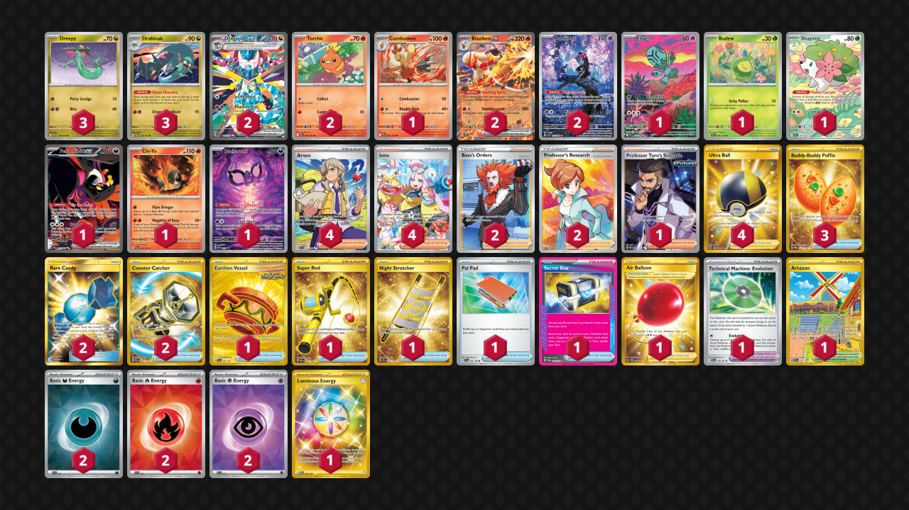

# Dragapult/Blaziken

Tier **2** | Difficulty: **Hard** | Gameplan: **Toolbox Spread**

**Source**: Fabien Pujol - [4th Place Regional Frankfurt](https://limitlesstcg.com/decks/list/19125)

## List
* 2 Torchic DRI 40
* 1 Combusken DRI 41
* 2 Blaziken ex JTG 24
* 2 Dragapult ex PRE 165
* 1 Elgyem BLK 120
* 3 Drakloak TWM 129
* 3 Dreepy TWM 128
* 2 Munkidori SFA 72
* 1 Budew PRE 4
* 1 Shaymin DRI 185
* 1 Fezandipiti ex SFA 92
* 1 Chi-Yu PAR 29
* 1 Pecharunt PR-SV 129
* 4 Arven SVI 235
* 1 Earthen Vessel SFA 96
* 1 Super Rod PAL 276
* 4 Iono PAL 269
* 1 Night Stretcher SSP 251
* 4 Ultra Ball BRS 186
* 2 Boss's Orders LOR-TG 24
* 1 Air Balloon SSH 213
* 1 Technical Machine: Evolution PAR 178
* 1 Artazon OBF 229
* 3 Buddy-Buddy Poffin TWM 223
* 1 Pal Pad SVI 182
* 1 Secret Box TWM 163
* 2 Rare Candy GRI 165
* 2 Counter Catcher PAR 264
* 1 Professor Turo's Scenario PAR 240
* 2 Professor's Research PR-SW 152
* 2 Basic {D} Energy SVE 15
* 2 Basic {R} Energy SVE 10
* 2 Basic {P} Energy SVE 13
* 1 Luminous Energy TWM 226