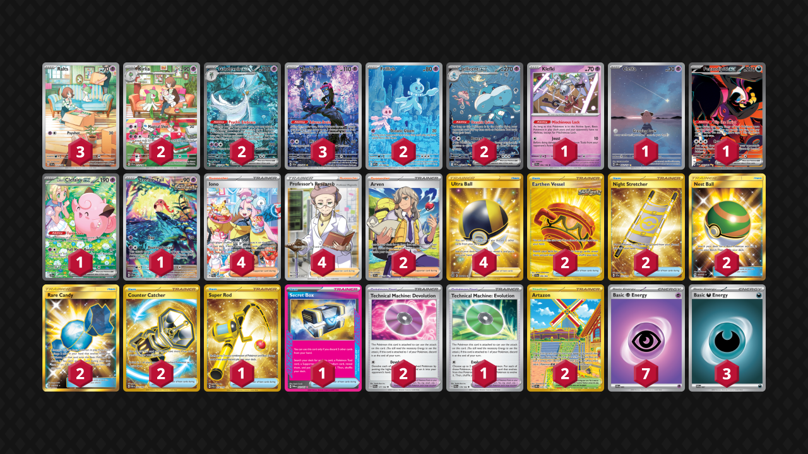

# Gardevoir/Jellicent

Tier **1** | Difficulty: **Hard** | Gameplan: **Disruption Accumulate**

**Source**: Reiji Nishiguchi - [Top 8 Japan Championships 2025](https://limitlesstcg.com/decks/list/18826)

## List
* 2 Jellicent ex WHT 168
* 1 Klefki SVI 96
* 2 Gardevoir ex PAF 233
* 2 Frillish WHT 126
* 3 Munkidori SFA 72
* 3 Ralts SVI 211
* 1 Cleffa OBF 202
* 2 Kirlia SVI 212
* 1 Fezandipiti ex SFA 92
* 1 Lillie's Clefairy ex JTG 184
* 1 Scream Tail PR-SV 65
* 2 Arven SVI 235
* 2 Earthen Vessel SFA 96
* 1 Super Rod PAL 276
* 4 Iono PAL 269
* 2 Night Stretcher SSP 251
* 2 Technical Machine: Devolution PAR 177
* 2 Nest Ball SUM 158
* 4 Ultra Ball BRS 186
* 1 Technical Machine: Evolution PAR 178
* 2 Artazon OBF 229
* 1 Secret Box TWM 163
* 2 Rare Candy GRI 165
* 2 Counter Catcher PAR 264
* 4 Professor's Research SSH 201
* 7 Basic {P} Energy SVE 5
* 3 Basic {D} Energy SVE 7