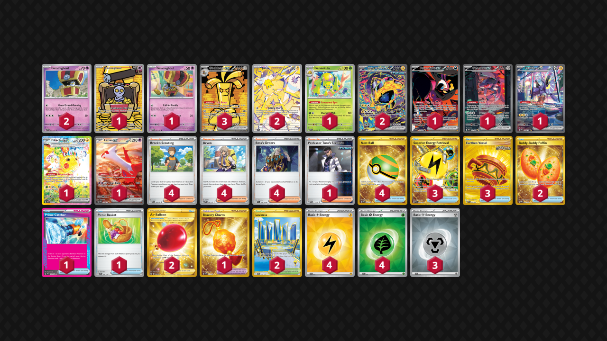

# Gholdengo/Joltik

Tier **2** | Difficulty: **Moderate** | Gameplan: **Midrange Breaker**

**Source**: Aaron Arturo Aguirre Osuna - [Top 16 World Championships 2025](https://limitlesstcg.com/decks/list/18931)

## List
* 1 Fezandipiti ex SFA 92
* 3 Gholdengo ex PAR 252
* 1 Galvantula SFA 2
* 1 Gimmighoul PAR 198
* 2 Joltik SCR 150
* 2 Iron Hands ex PRE 154
* 1 Genesect ex BLK 169
* 2 Gimmighoul SSP 97
* 1 Miraidon ex SVI 244
* 1 Gimmighoul PAR 87
* 1 Pikachu ex SSP 238
* 1 Latias ex SSP 239
* 2 Buddy-Buddy Poffin TWM 223
* 4 Brock's Scouting JTG 146
* 3 Superior Energy Retrieval PAL 277
* 4 Nest Ball SVI 255
* 3 Earthen Vessel SFA 96
* 1 Prime Catcher TEF 157
* 1 Picnic Basket SVI 184
* 4 Arven OBF 186
* 4 Boss's Orders PAL 172
* 1 Professor Turo's Scenario PAR 171
* 1 Bravery Charm SCR 175
* 2 Levincia DRI 244
* 2 Air Balloon SSH 213
* 4 Basic {L} Energy SVE 12
* 4 Basic {G} Energy SVE 9
* 3 Basic {M} Energy SVE 16