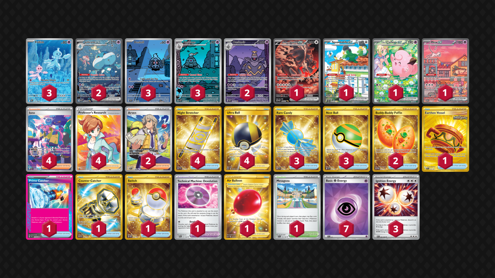

# Jellicent/Dusknoir

Tier **4** | Difficulty: **Moderate** | Gameplan: **Disruption Spread**

**Source**: Evan Campbell - [SMG Nightly Standard](https://play.limitlesstcg.com/tournament/68b48109827e9d163f833f0e/player/evancampbell94/decklist)

## List
* 1 Bloodmoon Ursaluna ex PRE 168
* 2 Jellicent ex WHT 168
* 1 Squawkabilly ex PAL 264
* 3 Dusclops SFA 69
* 3 Frillish WHT 126
* 3 Duskull SFA 68
* 1 Lillie's Clefairy ex JTG 184
* 1 Mew ex PR-SV 53
* 2 Dusknoir SFA 70
* 3 Rare Candy SVI 256
* 2 Arven SVI 235
* 1 Earthen Vessel SFA 96
* 4 Iono PAF 237
* 1 Mesagoza SVI 178
* 4 Night Stretcher SSP 251
* 1 Technical Machine: Devolution PAR 177
* 4 Ultra Ball BRS 186
* 1 Air Balloon SSH 213
* 2 Buddy-Buddy Poffin TWM 223
* 1 Prime Catcher TEF 157
* 1 Counter Catcher PAR 264
* 4 Professor's Research PR-SW 152
* 1 Switch MEW 206
* 3 Nest Ball SVI 255
* 3 Ignition Energy WHT 86
* 7 Basic {P} Energy SVE 13