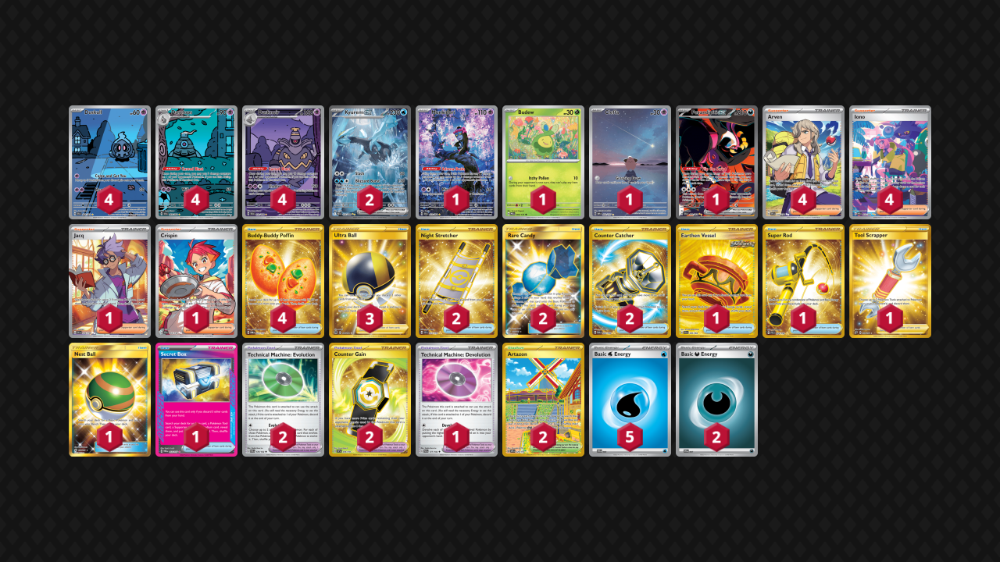

# Kyurem/Dusknoir

Tier **F** | Difficulty: **Moderate** | Gameplan: **Turbo Spread**

**Source**: Popsicle Knight - [YouTube video](www.youtube.com/watch?v=Uo6JjjAXgvo)

## List
* 4 Dusclops SFA 69
* 1 Munkidori SFA 72
* 1 Budew PRE 4
* 1 Cleffa OBF 202
* 4 Duskull SFA 68
* 1 Fezandipiti ex SFA 92
* 2 Kyurem ex BLK 165
* 4 Dusknoir SFA 70
* 4 Arven SVI 235
* 1 Earthen Vessel SFA 96
* 1 Jacq SVI 236
* 1 Super Rod PAL 276
* 4 Iono PAF 237
* 2 Night Stretcher SSP 251
* 1 Tool Scrapper RCL 208
* 1 Nest Ball SUM 158
* 1 Technical Machine: Devolution PAR 177
* 3 Ultra Ball BRS 186
* 2 Technical Machine: Evolution PAR 178
* 2 Artazon OBF 229
* 1 Crispin SCR 164
* 4 Buddy-Buddy Poffin TWM 223
* 1 Secret Box TWM 163
* 2 Rare Candy GRI 165
* 2 Counter Catcher PAR 264
* 2 Counter Gain SSP 249
* 2 Basic {D} Energy SVE 7
* 5 Basic {W} Energy SVE 3