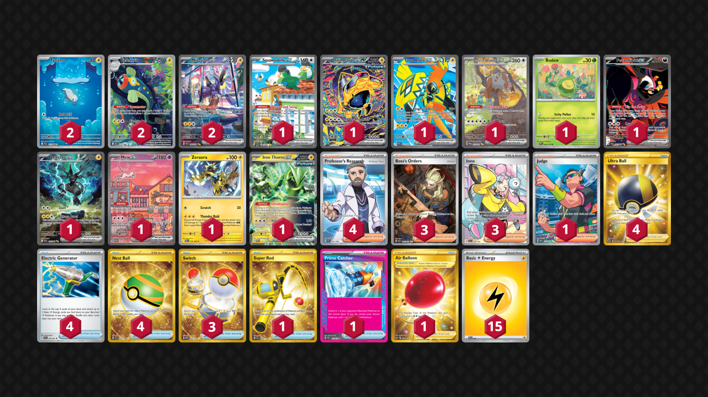

# Miraidon/Eelektrik

Tier **5** | Difficulty: **Hard** | Gameplan: **Midrange Toolbox**

**Source**: Andrew Mahone - [YouTube video](https://www.youtube.com/watch?v=Dpkz3dpf2Xs)

## List
* 2 Eelektrik BLK 114
* 1 Squawkabilly ex PAL 264
* 1 Iron Hands ex PRE 154
* 2 Tynamo BLK 113
* 1 Tapu Koko ex PAR 222
* 1 Bloodmoon Ursaluna ex TWM 216
* 1 Budew PRE 4 PH
* 2 Miraidon ex SVI 244
* 1 Fezandipiti ex SFA 92
* 1 Zekrom ex BLK 166
* 1 Mew ex PR-SV 53
* 1 Zeraora DRI 78
* 1 Iron Thorns ex TWM 77
* 3 Boss's Orders PAL 265
* 1 Super Rod PAL 276
* 1 Judge DRI 222
* 4 Ultra Ball BRS 186
* 1 Prime Catcher PRE 119
* 1 Air Balloon SSH 213
* 4 Professor's Research SVI 241
* 3 Iono PAL 254
* 4 Electric Generator PAF 79
* 3 Switch MEW 206
* 4 Nest Ball SVI 255
* 15 Basic {L} Energy SVE 4