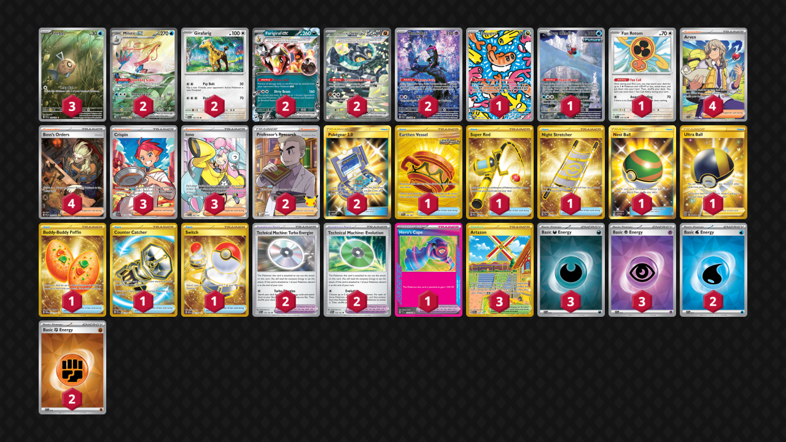

# Walls

Tier **3** | Difficulty: **Moderate** | Gameplan: **Stall**

**Source**: Ryunosuke Murata - [Top 128 World Championships 2025](https://limitlesstcg.com/decks/list/18990)

## List
* 3 Feebas SSP 198
* 2 Girafarig PAL 154
* 2 Cornerstone Mask Ogerpon ex TWM 215
* 2 Milotic ex SSP 237
* 1 Tatsugiri TWM 186
* 2 Munkidori SFA 72
* 1 Iron Bundle PR-SV 66
* 1 Fan Rotom SCR 118
* 2 Farigiraf ex TEF 108
* 4 Arven SVI 235
* 1 Earthen Vessel SFA 96
* 4 Boss's Orders PAL 265
* 1 Super Rod PAL 276
* 1 Night Stretcher SSP 251
* 1 Nest Ball SUM 158
* 1 Ultra Ball BRS 186
* 2 Technical Machine: Turbo Energize PAR 179
* 2 Technical Machine: Evolution PAR 178
* 2 Professor's Research CEL 24
* 3 Artazon OBF 229
* 1 Hero's Cape TEF 152
* 3 Crispin SCR 164
* 1 Buddy-Buddy Poffin TWM 223
* 3 Iono PAL 254
* 1 Counter Catcher PAR 264
* 2 Pokégear 3.0 UNB 233
* 1 Switch MEW 206
* 2 Basic {W} Energy SVE 11
* 2 Basic {F} Energy SVE 14
* 3 Basic {D} Energy SVE 15
* 3 Basic {P} Energy SVE 13