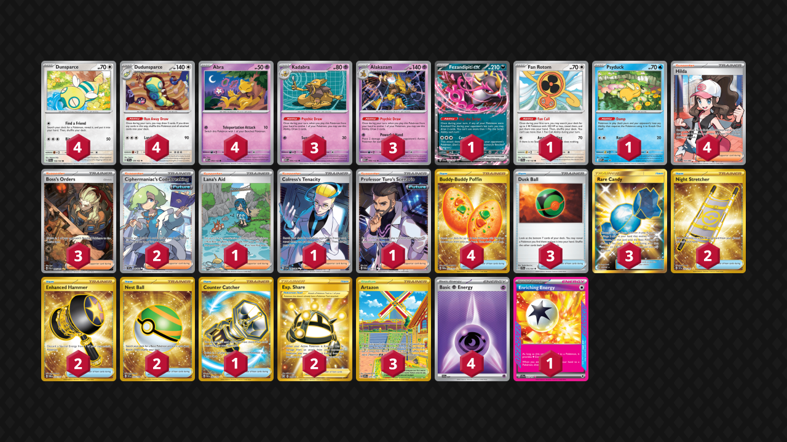

# Powerful Hand Alakazam

Tier **3** | Difficulty: **Moderate** | Gameplan: **Accumulate**

**Source**: Nikolaj Busow - [Top 64 Regional Lille](https://limitlesstcg.com/decks/list/20705)

## List
* 3 Kadabra MEG 55
* 4 Dunsparce PAL 156
* 4 Abra MEG 54
* 3 Alakazam MEG 56
* 1 Fezandipiti ex SFA 38
* 4 Dudunsparce TEF 129
* 1 Fan Rotom SCR 118
* 1 Psyduck MEP 7
* 3 Boss's Orders PAL 265
* 2 Ciphermaniac's Codebreaking TEF 198
* 2 Night Stretcher SSP 251
* 1 Lana's Aid TWM 219
* 3 Dusk Ball SSP 175
* 2 Exp. Share BST 180
* 3 Artazon OBF 229
* 4 Buddy-Buddy Poffin TWM 223
* 1 Colress's Tenacity SFA 87
* 2 Enhanced Hammer TWM 224
* 3 Rare Candy GRI 165
* 1 Counter Catcher PAR 264
* 1 Professor Turo's Scenario PAR 240
* 4 Hilda WHT 164
* 2 Nest Ball SVI 255
* 1 Enriching Energy SSP 191
* 4 Basic {P} Energy SVE 21
