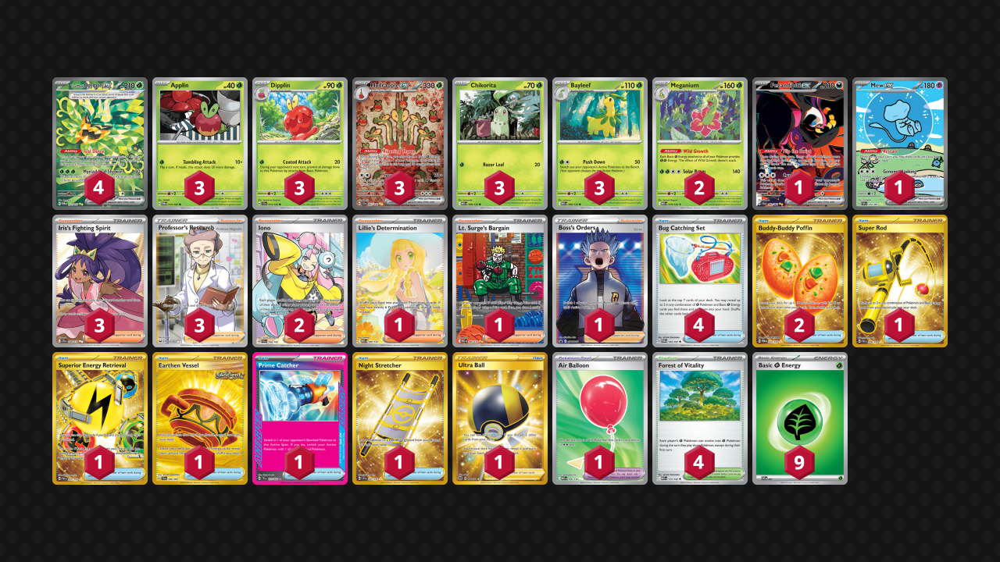

# Hydrapple/Meganium

Tier **5** | Difficulty: **Moderate** | Gameplan: **Accumulate**

**Source**: ForTheWinTCG - [YouTube video](https://www.youtube.com/watch?v=7d7vdTkAQ0k)

## List
* 3 Hydrapple ex SCR 167
* 1 Fezandipiti ex SFA 92
* 3 Dipplin SCR 13
* 2 Meganium MEG 10
* 3 Applin TWM 17
* 4 Teal Mask Ogerpon ex TWM 211
* 1 Mew ex PAF 232
* 3 Bayleef MEG 9
* 3 Chikorita MEG 8
* 4 Forest of Vitality MEG 117
* 2 Buddy-Buddy Poffin TWM 223
* 3 Iris's Fighting Spirit JTG 180
* 2 Iono PAL 254
* 4 Bug Catching Set TWM 143
* 1 Lillie's Determination MEG 184
* 1 Lt. Surge's Bargain MEG 185
* 1 Super Rod PAL 276
* 1 Superior Energy Retrieval PAL 277
* 1 Air Balloon MEG 166
* 1 Boss's Orders PR-SW 251
* 1 Earthen Vessel SFA 96
* 1 Prime Catcher TEF 157
* 3 Professor's Research SSH 201
* 1 Night Stretcher SSP 251
* 1 Ultra Ball BRS 186
* 9 Basic {G} Energy SVE 1