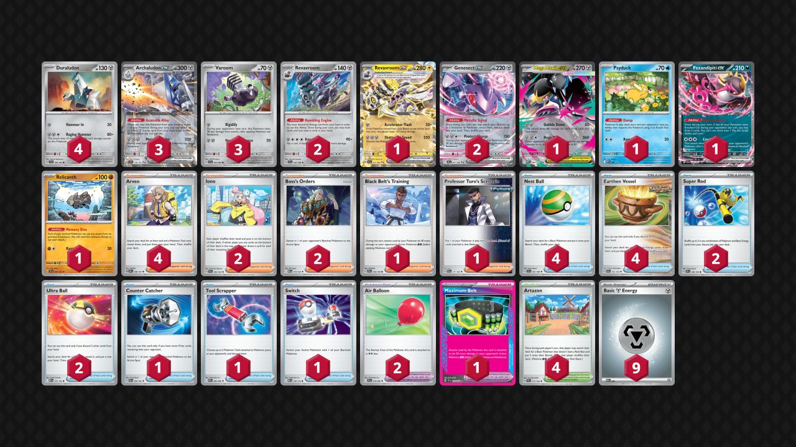

# Archaludon/Revavroom

Tier **5** | Difficulty: **Moderate** | Gameplan: **Midrange**

**Source**: ばんびー - [2nd Place City League Kanagawa 12/02](https://limitlesstcg.com/decks/list/jp/52706)

## List
* 1 Mega Mawile ex MEG 94
* 2 Genesect ex BLK 67
* 1 Psyduck MEP 7
* 4 Duraludon SCR 106
* 3 Archaludon ex SSP 130
* 1 Fezandipiti ex SFA 38
* 3 Varoom SFA 43
* 1 Revavroom ex SFA 15
* 2 Revavroom SVI 142
* 1 Relicanth TEF 84
* 1 Counter Catcher PAR 160
* 1 Tool Scrapper WHT 85
* 1 Black Belt's Training JTG 145
* 1 Maximum Belt TEF 154
* 4 Nest Ball SVI 181
* 4 Artazon PAL 171
* 4 Arven OBF 186
* 2 Air Balloon BLK 79
* 2 Iono PAL 185
* 1 Professor Turo's Scenario PAR 171
* 2 Super Rod PAL 188
* 1 Switch MEG 130
* 2 Ultra Ball MEG 131
* 2 Boss's Orders MEG 114
* 4 Earthen Vessel PAR 163
* 9 Basic {M} Energy MEE 8