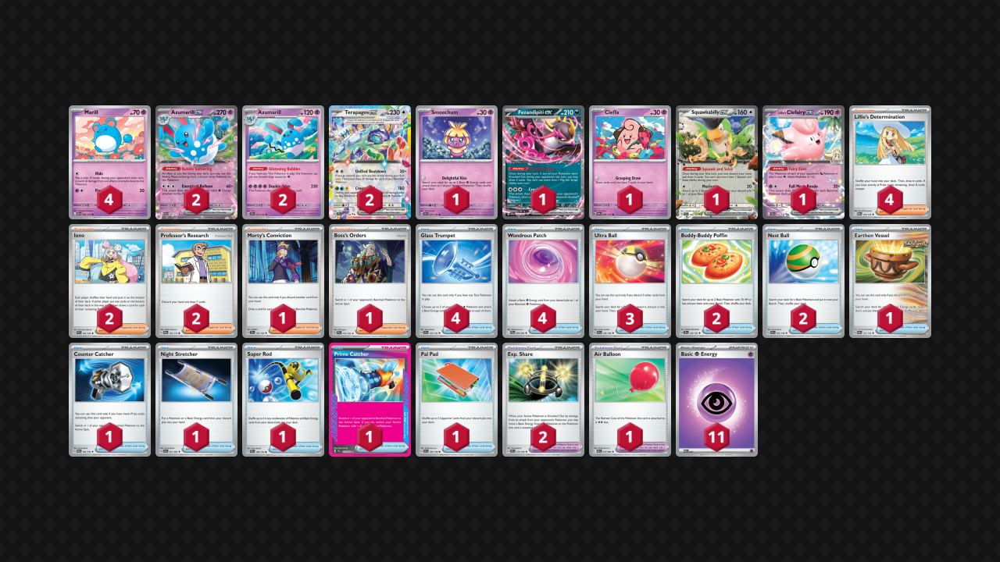

# Azumarill/Terapagos

Tier **5** | Difficulty: **Moderate** | Gameplan: **Midrange Accumulate**

**Source**: TrustYourPilot Pokemon - [YouTube video](www.youtube.com/watch?v=VrkQooDq8ko)

## List
* 1 Smoochum SSP 75
* 2 Terapagos ex SCR 128
* 2 Azumarill ex ASC 84
* 4 Marill ASC 83
* 2 Azumarill SSP 74
* 1 Fezandipiti ex SFA 38
* 1 Cleffa OBF 80
* 1 Squawkabilly ex PAL 169
* 1 Lillie's Clefairy ex JTG 56
* 3 Ultra Ball SVI 196
* 2 Exp. Share SVI 174
* 1 Earthen Vessel PAR 163
* 2 Buddy-Buddy Poffin TEF 144
* 4 Lillie's Determination MEG 119
* 1 Counter Catcher PAR 160
* 4 Glass Trumpet SCR 135
* 2 Iono PAL 185
* 1 Air Balloon BLK 79
* 1 Night Stretcher SFA 61
* 1 Super Rod PAL 188
* 2 Professor's Research PRE 122
* 1 Prime Catcher TEF 157
* 1 Pal Pad SVI 182
* 1 Morty's Conviction TEF 155
* 2 Nest Ball SVI 181
* 4 Wondrous Patch PFL 94
* 1 Boss's Orders PAL 172
* 11 Basic {P} Energy MEE 5