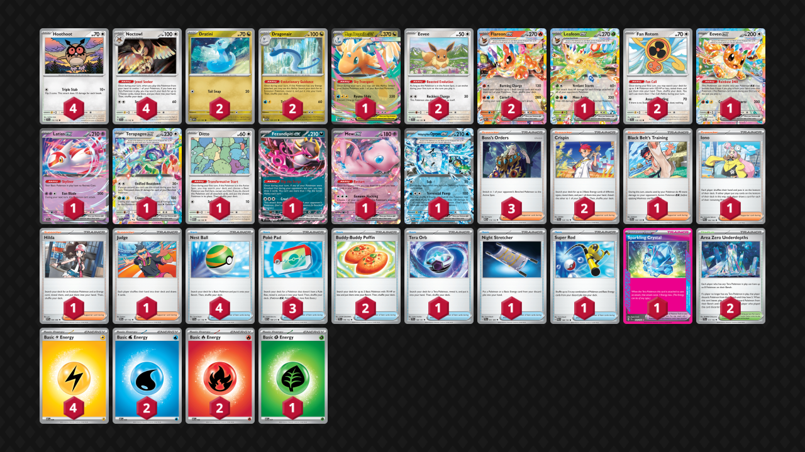

# Flareon/Noctowl/Dragonair

Tier **5** | Difficulty: **Hard** | Gameplan: **Midrange**

**Source**: アイギス - [2nd Place City League Kanagawa 01/04](https://limitlesstcg.com/decks/list/jp/56946)

## List
* 1 Eevee ex PRE 75
* 1 Latias ex SSP 76
* 1 Terapagos ex SCR 128
* 2 Dratini OBF 157
* 2 Eevee SSP 143
* 1 Mega Dragonite ex ASC 152
* 2 Dragonair ASC 151
* 1 Ditto MEW 132
* 1 Fezandipiti ex SFA 38
* 1 Mew ex MEW 151
* 2 Flareon ex PRE 14
* 1 Leafeon ex PRE 6
* 4 Hoothoot SCR 114
* 1 Wellspring Mask Ogerpon ex TWM 64
* 4 Noctowl SCR 115
* 2 Fan Rotom SCR 118
* 1 Tera Orb SSP 189
* 1 Black Belt's Training JTG 143
* 1 Night Stretcher SFA 61
* 4 Nest Ball SVI 181
* 3 Poké Pad ASC 198
* 1 Iono PAL 185
* 1 Hilda WHT 84
* 1 Super Rod PAL 188
* 2 Area Zero Underdepths SCR 131
* 2 Crispin SCR 133
* 1 Judge DRI 167
* 2 Buddy-Buddy Poffin TEF 144
* 1 Sparkling Crystal SCR 142
* 3 Boss's Orders MEG 114
* 4 Basic {L} Energy MEE 4
* 1 Basic {G} Energy MEE 1
* 2 Basic {W} Energy MEE 3
* 2 Basic {R} Energy MEE 2