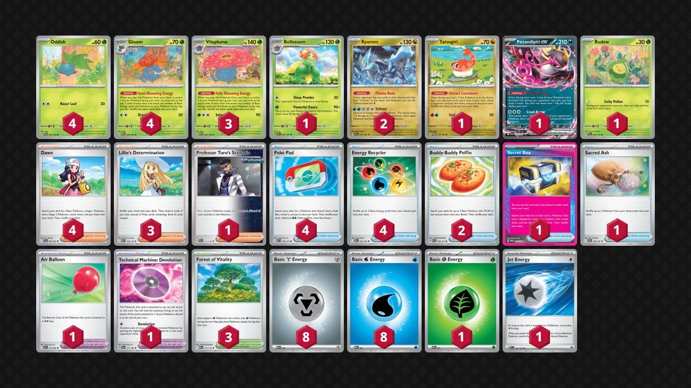

# Kyurem/Vileplume

Tier **F** | Difficulty: **Moderate** | Gameplan: **Combo**

**Source**: nan - [Card Secret（東京）TOP16](https://www.pokemon-card.com/deck/confirm.html/deckID/9PLnLg-CODRc9-g9NLLi)

## List
* 4 Oddish MEW 43
* 4 Gloom MEW 44
* 1 Tatsugiri TWM 131
* 2 Kyurem SFA 47
* 1 Bellossom OBF 3
* 1 Fezandipiti ex SFA 38
* 1 Budew PRE 4
* 3 Vileplume MEW 45
* 2 Buddy-Buddy Poffin ASC 184
* 4 Poké Pad ASC 198
* 3 Lillie's Determination MEG 119
* 1 Air Balloon BLK 79
* 4 Energy Recycler DRI 164
* 1 Professor Turo's Scenario PAR 171
* 1 Technical Machine: Devolution PAR 177
* 3 Forest of Vitality MEG 117
* 1 Secret Box TWM 163
* 4 Dawn PFL 87
* 1 Sacred Ash DRI 168
* 8 Basic {M} Energy MEE 8
* 1 Basic {G} Energy MEE 1
* 8 Basic {W} Energy MEE 3
* 1 Jet Energy PAL 190