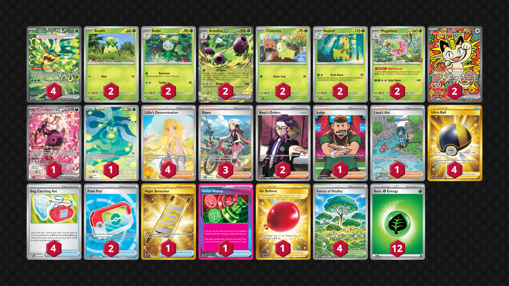

# Arboliva/Meganium

Tier **2** | Difficulty: **Moderate** | Gameplan: **Turbo**

**Source**: Wataru Yano - [2nd Place Champions League Fukuoka](https://limitlesstcg.com/decks/list/24429)

## List
* 2 Smoliv DRI 21
* 2 Dolliv DRI 22
* 2 Arboliva ex DRI 23
* 1 Fezandipiti ex ASC 288
* 2 Meganium MEP 1
* 2 Meowth ex POR 121
* 2 Bayleef MEG 9
* 4 Teal Mask Ogerpon ex TWM 211
* 1 Budew ASC 221
* 2 Chikorita MEP 69
* 2 Poké Pad POR 113
* 2 Boss's Orders ASC 256
* 1 Night Stretcher SSP 251
* 1 Unfair Stamp TWM 165
* 1 Judge PAF 228
* 4 Ultra Ball BRS 186
* 4 Forest of Vitality POR 109
* 4 Lillie's Determination MEG 184
* 4 Bug Catching Set TWM 143
* 1 Air Balloon SSH 213
* 1 Lana's Aid TWM 219
* 3 Dawn PFL 129
* 12 Basic {G} Energy MEE 1