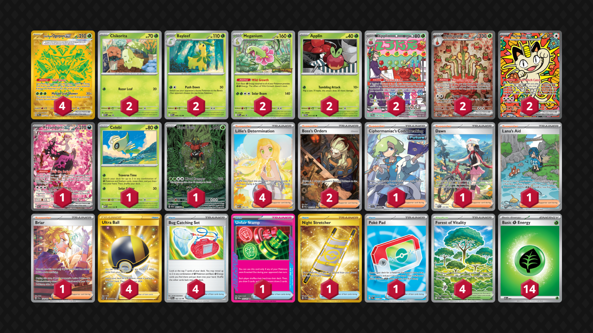

# Hydrapple/Ogerpon

Tier **1** | Difficulty: **Moderate** | Gameplan: **Midrange Accumulate**

**Source**: Brandon Salazar - [Top 64 Regional Los Angeles, CA](https://limitlesstcg.com/decks/list/26536)

## List
* 2 Hydrapple ex SCR 167
* 2 Meganium MEP 1
* 1 Fezandipiti ex ASC 288
* 2 Chikorita MEP 69
* 1 Celebi MEG 12
* 2 Meowth ex POR 121
* 2 Bayleef MEG 9
* 1 Tapu Bulu SFA 65
* 4 Teal Mask Ogerpon ex PRE 177
* 2 Dipplin TWM 170
* 2 Applin TWM 17
* 4 Lillie's Determination MEG 184
* 1 Unfair Stamp TWM 165
* 1 Ciphermaniac's Codebreaking TEF 198
* 4 Forest of Vitality POR 109
* 1 Dawn PFL 129
* 1 Lana's Aid TWM 219
* 2 Boss's Orders PAL 265
* 1 Night Stretcher SSP 251
* 1 Briar SCR 171
* 4 Ultra Ball BRS 186
* 1 Poké Pad POR 113
* 4 Bug Catching Set PRE 102
* 14 Basic {G} Energy MEE 1