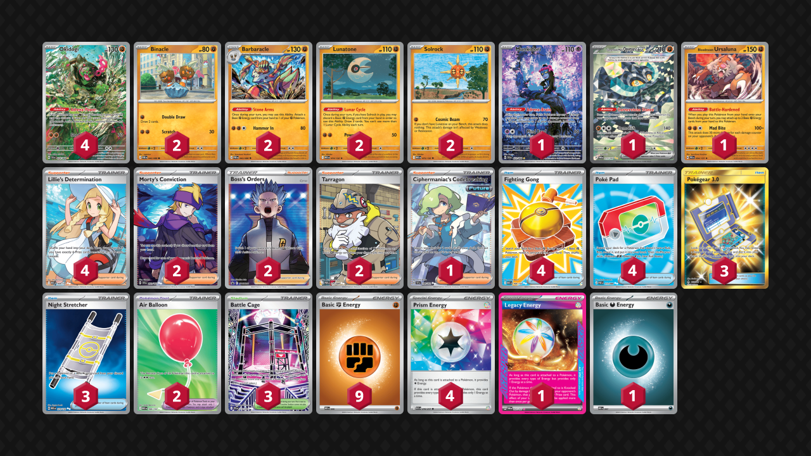

# Okidogi/Barbaracle

Tier **3** | Difficulty: **Moderate** | Gameplan: **Midrange**

**Source**: tomoka - [1st Place City League Kanagawa 02/15](https://limitlesstcg.com/decks/list/jp/62157)

## List
* 1 Munkidori SFA 72
* 2 Barbaracle POR 43
* 2 Lunatone MEG 74
* 4 Okidogi SFA 74
* 1 Cornerstone Mask Ogerpon ex TWM 215
* 2 Solrock MEG 75
* 1 Bloodmoon Ursaluna PRE 54
* 2 Binacle POR 42
* 4 Fighting Gong MEG 168
* 4 Lillie's Determination MEG 169
* 1 Ciphermaniac's Codebreaking TEF 198
* 2 Morty's Conviction TEF 201
* 2 Air Balloon MEG 166
* 2 Boss's Orders PR-SW 251
* 3 Pokégear 3.0 UNB 233
* 3 Night Stretcher MEG 173
* 4 Poké Pad POR 113
* 2 Tarragon POR 116
* 3 Battle Cage PFL 116
* 1 Legacy Energy TWM 167
* 4 Prism Energy ASC 216
* 1 Basic {D} Energy MEE 7
* 9 Basic {F} Energy MEE 6