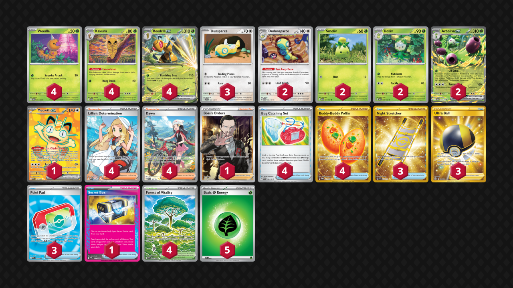

# Beedrill/Arboliva

Tier **3** | Difficulty: **Moderate** | Gameplan: **Midrange Spread**

**Source**: Nuts+ - [1st Place City League Ōsaka 03/17](https://limitlesstcg.com/decks/list/jp/64983)

## List
* 2 Arboliva ex DRI 23
* 2 Dolliv DRI 22
* 1 Meowth ex POR 107
* 2 Dudunsparce PRE 80
* 3 Dunsparce JTG 120
* 2 Smoliv DRI 21
* 4 Weedle CRI 1
* 4 Kakuna CRI 2
* 4 Beedrill ex CRI 3
* 4 Bug Catching Set PRE 102
* 4 Forest of Vitality POR 109
* 4 Lillie's Determination MEG 169
* 3 Night Stretcher SSP 251
* 3 Ultra Ball BRS 186
* 4 Dawn PFL 129
* 4 Buddy-Buddy Poffin TWM 223
* 1 Secret Box TWM 163
* 3 Poké Pad POR 113
* 1 Boss's Orders RCL 189
* 5 Basic {G} Energy MEE 1