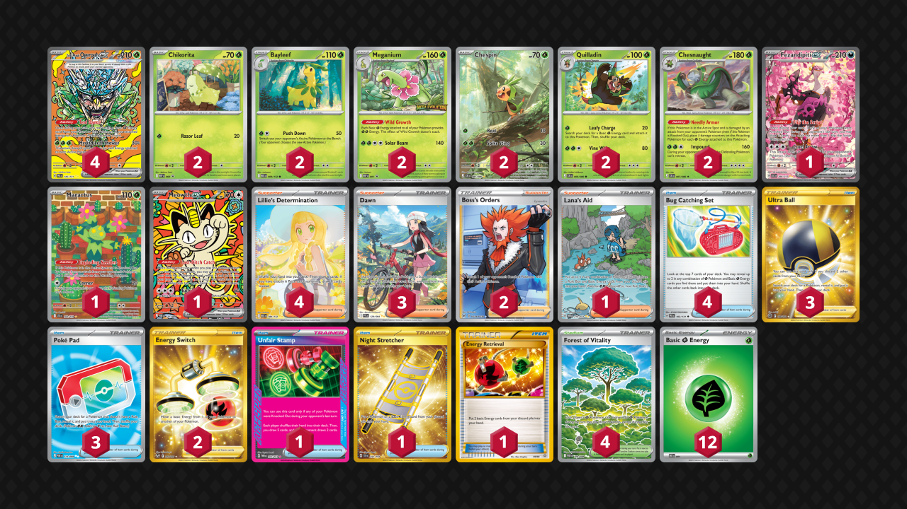

# Chesnaught/Meganium

Tier **5** | Difficulty: **Moderate** | Gameplan: **Midrange**

**Source**: かいち - [4th Place City League Ōsaka 04/14](https://limitlesstcg.com/decks/list/jp/68503)

## List
* 2 Chesnaught CRI 7
* 4 Teal Mask Ogerpon ex PRE 145
* 2 Meganium MEP 1
* 2 Quilladin CRI 6
* 1 Fezandipiti ex ASC 288
* 2 Chikorita MEP 69
* 1 Maractus JTG 160
* 1 Meowth ex POR 121
* 2 Bayleef MEG 9
* 2 Chespin CRI 87
* 4 Lillie's Determination MEG 184
* 1 Unfair Stamp TWM 165
* 2 Boss's Orders LOR-TG 24
* 4 Forest of Vitality POR 109
* 3 Dawn PFL 129
* 1 Lana's Aid TWM 219
* 2 Energy Switch SIT 212
* 1 Night Stretcher SSP 251
* 3 Ultra Ball BRS 186
* 3 Poké Pad POR 113
* 4 Bug Catching Set PRE 102
* 1 Energy Retrieval AOR 99
* 12 Basic {G} Energy MEE 1