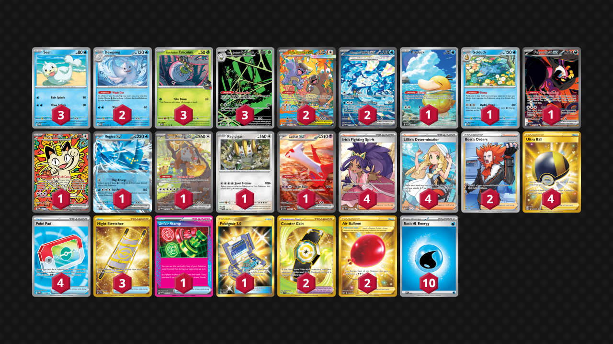

# Dewgong/Spidops

Tier **5** | Difficulty: **Hard** | Gameplan: **Toolbox**

**Source**: Hitmonchanning - [YouTube video](https://www.youtube.com/watch?v=hP1Ecxl7SSw)

## List
* 2 Mega Kangaskhan ex MEG 182
* 1 Fezandipiti ex SFA 92
* 1 Meowth ex POR 121
* 3 Seel POR 18
* 1 Regice ex ASC 48
* 2 Wellspring Mask Ogerpon ex TWM 213
* 1 Bloodmoon Ursaluna ex TWM 216
* 1 Regigigas PRE 86
* 1 Psyduck ASC 226
* 3 Team Rocket's Spidops DRI 187
* 3 Team Rocket's Tarountula DRI 19
* 2 Dewgong POR 19
* 1 Golduck ASC 40
* 1 Latias ex SSP 239
* 4 Iris's Fighting Spirit JTG 180
* 2 Counter Gain SSP 249
* 1 Unfair Stamp TWM 165
* 4 Lillie's Determination MEG 169
* 2 Boss's Orders LOR-TG 24
* 1 Pokégear 3.0 UNB 233
* 3 Night Stretcher SSP 251
* 4 Ultra Ball BRS 186
* 4 Poké Pad POR 113
* 2 Air Balloon SSH 213
* 10 Basic {W} Energy MEE 3