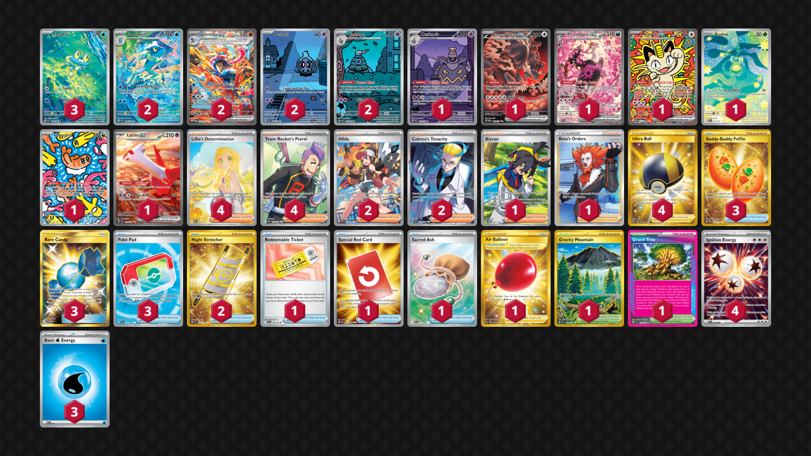

# Greninja/Dusknoir

Tier **4** | Difficulty: **Hard** | Gameplan: **Midrange Spread**

**Source**: jewels_the_sk8r - TrickyGym Discord server

## List
* 1 Bloodmoon Ursaluna ex PRE 168
* 3 Froakie CRI 88
* 1 Fezandipiti ex ASC 288
* 1 Meowth ex POR 121
* 2 Duskull SFA 68
* 2 Greninja ex TWM 214
* 2 Frogadier CRI 89
* 1 Budew ASC 221
* 2 Dusclops SFA 69
* 1 Tatsugiri TWM 186
* 1 Dusknoir SFA 70
* 1 Latias ex SSP 239
* 1 Kieran TWM 206
* 3 Buddy-Buddy Poffin TWM 223
* 4 Lillie's Determination MEG 184
* 3 Rare Candy GRI 165
* 1 Boss's Orders LOR-TG 24
* 1 Redeemable Ticket JTG 156
* 1 Gravity Mountain SSP 250
* 2 Night Stretcher SSP 251
* 2 Hilda WHT 171
* 4 Ultra Ball BRS 186
* 3 Poké Pad POR 113
* 2 Colress's Tenacity SFA 87
* 1 Special Red Card CRI 113
* 1 Grand Tree SCR 136
* 1 Sacred Ash POR 115
* 4 Team Rocket's Petrel DRI 226
* 1 Air Balloon SSH 213
* 3 Basic {W} Energy MEE 3
* 4 Ignition Energy PFL 124