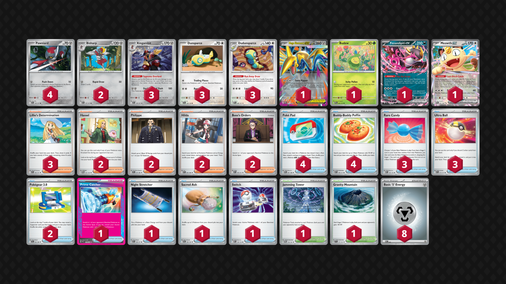

# Supreme Overlord Kingambit

Tier **F** | Difficulty: **Moderate** | Gameplan: **Midrange**

**Source**: Sivta Tres

## List
* 1 Mega Skarmory ex POR 55
* 3 Dudunsparce PRE 80
* 3 Dunsparce JTG 120
* 1 Budew PRE 4
* 3 Kingambit ASC 148
* 4 Pawniard ASC 146
* 2 Bisharp ASC 147
* 1 Fezandipiti ex ASC 142
* 1 Meowth ex POR 62
* 1 Prime Catcher PRE 119
* 4 Poké Pad POR 81
* 2 Pokégear 3.0 BLK 84
* 3 Rare Candy MEG 125
* 3 Ultra Ball ASC 213
* 1 Night Stretcher ASC 196
* 3 Lillie's Determination ASC 192
* 2 Hassel TWM 151
* 1 Sacred Ash DRI 168
* 1 Jamming Tower TWM 153
* 2 Philippe CRI 79
* 2 Hilda WHT 84
* 4 Buddy-Buddy Poffin ASC 184
* 1 Switch MEG 130
* 2 Boss's Orders ASC 183
* 1 Gravity Mountain SSP 177
* 8 Basic {M} Energy MEE 8