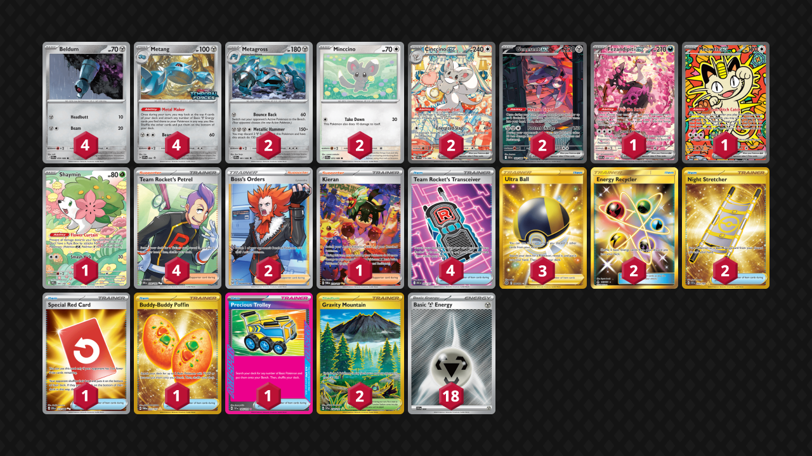

# Cinccino/Metang

Tier **5** | Difficulty: **Moderate** | Gameplan: **Midrange Accumulate**

**Source**: クロガネ - [3rd Place City League Kanagawa 04/05](https://limitlesstcg.com/decks/list/jp/67066)

## List
* 1 Fezandipiti ex ASC 288
* 2 Metagross CRI 61
* 1 Meowth ex POR 121
* 2 Minccino CRI 72
* 4 Beldum CRI 59
* 1 Shaymin DRI 185
* 4 Metang PR-SV 90
* 2 Genesect ex BLK 169
* 2 Cinccino ex CRI 119
* 4 Team Rocket's Petrel DRI 226
* 2 Gravity Mountain SSP 250
* 2 Energy Recycler FLI 143
* 2 Night Stretcher SSP 251
* 1 Special Red Card CRI 113
* 1 Buddy-Buddy Poffin TWM 223
* 1 Precious Trolley SSP 185
* 2 Boss's Orders LOR-TG 24
* 3 Ultra Ball BRS 186
* 1 Kieran TWM 218
* 4 Team Rocket's Transceiver ASC 263
* 18 Basic {M} Energy SVE 24