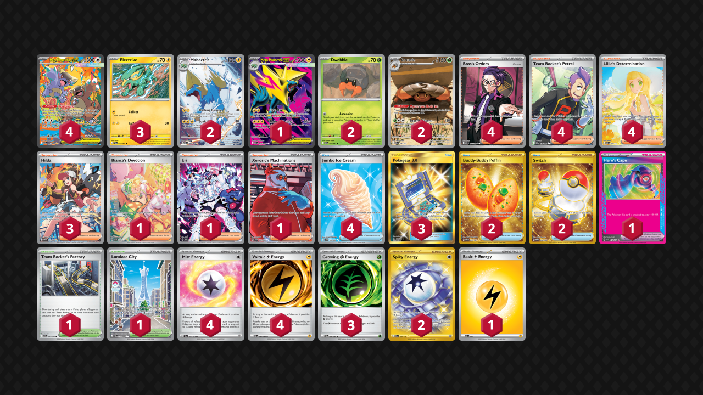

# Crustle/Manectric

Tier **4** | Difficulty: **Hard** | Gameplan: **Wall Stall**

**Source**: TMT2012 - [WORLDS OF DOOM! 2026! DAY TWO!](https://play.limitlesstcg.com/tournament/worlds-of-doom-day-two/player/tmt2012/decklist)

## List
* 2 Manectric PBL 89
* 2 Dwebble DRI 11
* 2 Crustle DRI 186
* 1 Mega Manectric ex MEG 158
* 3 Electrike PBL 23
* 4 Mega Kangaskhan ex MEG 182
* 1 Bianca's Devotion TEF 209
* 1 Team Rocket's Factory ASC 203
* 4 Boss's Orders ASC 256
* 1 Eri TEF 210
* 3 Hilda WHT 171
* 1 Xerosic's Machinations SFA 89
* 1 Hero's Cape TEF 152
* 2 Buddy-Buddy Poffin TWM 223
* 4 Team Rocket's Petrel DRI 226
* 3 Pokégear 3.0 UNB 233
* 4 Jumbo Ice Cream CRI 109
* 1 Lumiose City POR 111
* 4 Lillie's Determination MEG 184
* 2 Switch MEW 206
* 4 Mist Energy TEF 161
* 1 Basic {L} Energy MEE 4
* 2 Spiky Energy JTG 190
* 4 Voltaic {L} Energy PBL 84
* 3 Growing {G} Energy POR 86