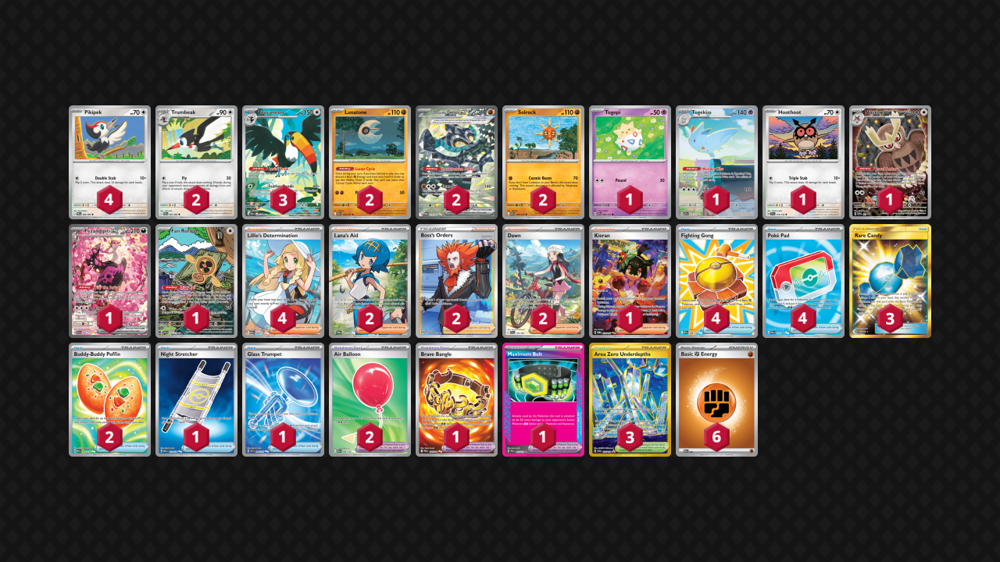

# Toucannon/Rocks

Tier **F** | Difficulty: **Moderate** | Gameplan: **Midrange**

**Source**: D34D_M4N14C - TrickyGym Discord server

## List
* 3 Toucannon PBL 94
* 4 Pikipek PBL 66
* 1 Fezandipiti ex ASC 288
* 2 Lunatone ASC 105
* 1 Togepi ASC 80
* 1 Noctowl PR-SV 141
* 1 Togekiss ASC 235
* 2 Trumbeak PBL 67
* 2 Cornerstone Mask Ogerpon ex TWM 215
* 1 Fan Rotom ASC 250
* 1 Hoothoot SCR 114
* 2 Solrock ASC 106
* 2 Lana's Aid TWM 207
* 3 Rare Candy GRI 165
* 4 Fighting Gong MEG 168
* 4 Lillie's Determination MEG 169
* 1 Brave Bangle PBL 104
* 2 Air Balloon MEG 166
* 2 Buddy-Buddy Poffin MEG 167
* 1 Maximum Belt PRE 117
* 2 Boss's Orders LOR-TG 24
* 2 Dawn PFL 129
* 1 Kieran TWM 218
* 1 Night Stretcher MEG 173
* 3 Area Zero Underdepths SCR 174
* 4 Poké Pad POR 113
* 1 Glass Trumpet ASC 260
* 6 Basic {F} Energy MEE 6