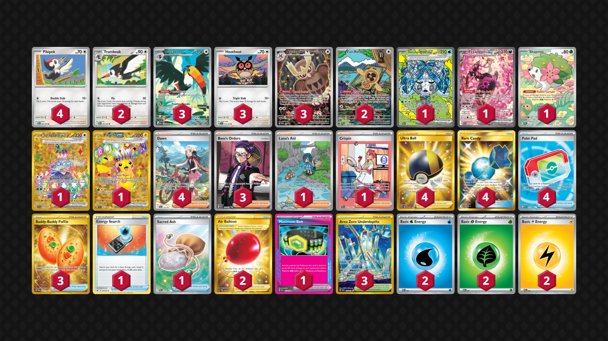

# Toucannon/Terapagos

Tier **5** | Difficulty: **Moderate** | Gameplan: **Midrange Toolbox**

**Source**: Andrew Mahone - TrickyGym Discord server

## List
* 1 Wellspring Mask Ogerpon ex PRE 152
* 3 Toucannon PBL 94
* 2 Fan Rotom ASC 250
* 4 Pikipek PBL 66
* 1 Fezandipiti ex ASC 288
* 1 Shaymin DRI 185
* 3 Hoothoot SCR 114
* 2 Trumbeak PBL 67
* 1 Terapagos ex SCR 173
* 3 Noctowl PR-SV 141
* 1 Pikachu ex SSP 247
* 3 Boss's Orders ASC 256
* 1 Lana's Aid TWM 219
* 4 Ultra Ball BRS 186
* 4 Dawn PFL 129
* 2 Air Balloon SSH 213
* 1 Energy Search SSH 161
* 3 Buddy-Buddy Poffin TWM 223
* 1 Maximum Belt PRE 117
* 1 Crispin PRE 171
* 3 Area Zero Underdepths SCR 174
* 4 Rare Candy GRI 165
* 4 Poké Pad POR 113
* 1 Sacred Ash POR 115
* 2 Basic {W} Energy MEE 3
* 2 Basic {G} Energy MEE 1
* 2 Basic {L} Energy MEE 4