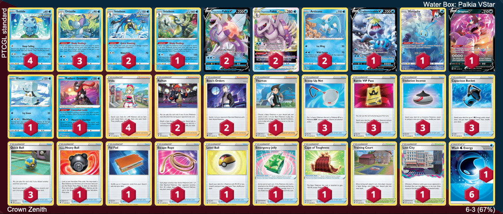

# Palkia VStar/Inteleon

Author: Piper Lepine

## List
* 2 Origin Forme Palkia V ASR 39
* 1 Crabominable V FST 76
* 4 Sobble CRE 41
* 2 Inteleon CRE 43
* 1 Manaphy CRZ-GG 6
* 3 Drizzile SSH 56
* 2 Articuno SIT 036
* 1 Drapion V LOR 118
* 1 Eiscue EVS 47
* 2 Origin Forme Palkia VSTAR ASR 40
* 1 Radiant Greninja ASR 46
* 1 Inteleon SSH 58
* 1 Hisuian Heavy Ball ASR 146
* 1 Pal Pad SSH 172
* 2 Raihan EVS 152
* 1 Escape Rope BST 125
* 1 Level Ball BST 129
* 4 Irida ASR 147
* 3 Scoop Up Net RCL 165
* 1 Thorton LOR 167
* 3 Battle VIP Pass FST 225
* 1 Emergency Jelly SIT 155
* 1 Training Court RCL 169
* 1 Cape of Toughness DAA 160
* 1 Lost City LOR 161 PH
* 3 Evolution Incense SSH 163
* 3 Capacious Bucket RCL 156
* 2 Boss's Orders BRS 132
* 3 Quick Ball FST 237
* 6 Basic {W} Energy Energy 3
