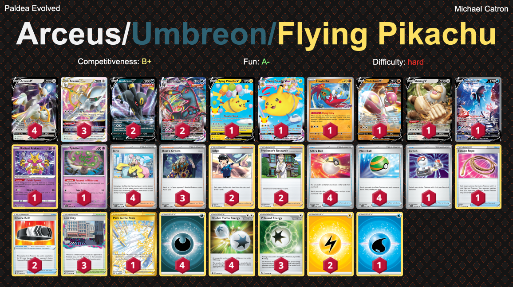

# Arceus/Umbreon/Pikachu

## List
* 3 Arceus VSTAR BRS 123
* 4 Arceus V BRS 122
* 1 Flying Pikachu VMAX CEL 7
* 1 Flying Pikachu V CEL 6
* 2 Umbreon VMAX EVS 95
* 1 Hawlucha PR-SV 7
* 1 Medicham V EVS 83
* 1 Slaking V PGO 58
* 1 Lumineon V BRS 156
* 1 Radiant Alakazam SIT 59
* 1 Spiritomb PAL 89
* 2 Umbreon V EVS 94
* 4 Ultra Ball SVI 196
* 1 Switch SVI 194
* 2 Judge FST 235
* 1 Escape Rope BST 125
* 1 Path to the Peak ASR 213
* 3 Lost City LOR 161
* 4 Iono PAL 185
* 2 Professor's Research SSH 178
* 4 Nest Ball SVI 181
* 2 Choice Belt BRS 135
* 3 Boss's Orders PAL 172
* 4 Basic {D} Energy Energy 7
* 2 Basic {L} Energy Energy 4
* 3 V Guard Energy SIT 169
* 1 Basic {W} Energy Energy 3
* 4 Double Turbo Energy BRS 151
