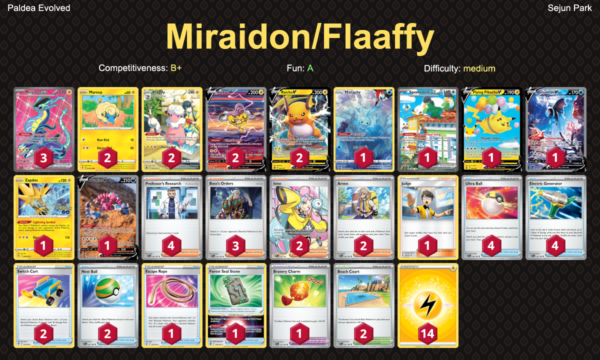

# Miraidon/Flaaffy

## List
* 2 Raikou V CRZ-GG 41
* 2 Flaaffy SIT-TG 3
* 1 Manaphy CRZ-GG 6
* 2 Raichu V BRS 45
* 1 Squawkabilly ex PAL 264
* 1 Flying Pikachu V CEL 6
* 1 Lumineon V BRS 156
* 2 Mareep EVS 54
* 1 Zapdos PGO 29
* 3 Miraidon ex SVI 227
* 1 Drapion V CRZ-GG 49
* 1 Judge FLI 108
* 4 Ultra Ball SVI 196
* 2 Switch Cart ASR 154
* 4 Professor's Research SVI 190
* 1 Escape Rope BST 125
* 4 Electric Generator SVI 170
* 2 Iono PAL 254
* 1 Forest Seal Stone SIT 156
* 2 Nest Ball SVI 181
* 1 Bravery Charm PAL 173
* 2 Arven SVI 166
* 3 Boss's Orders PAL 172
* 2 Beach Court SVI 167
* 14 Basic {L} Energy SVE 4
