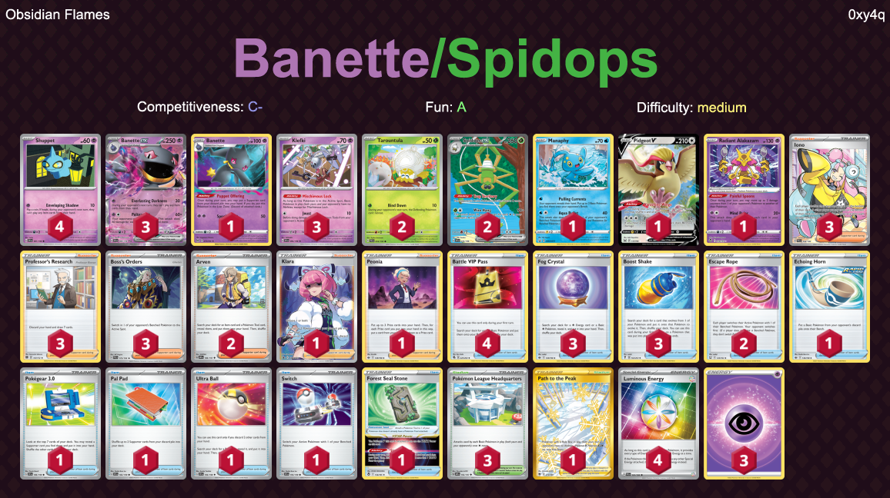

# Banette-Spidops

## List
* 1 Banette LOR 73
* 1 Manaphy PR-SW 275
* 1 Pidgeot V LOR 137
* 4 Shuppet SVI 87
* 2 Tarountula PAL 16
* 3 Banette ex SVI 88
* 2 Spidops ex SVI 243
* 3 Klefki SVI 96
* 1 Radiant Alakazam SIT 59
* 3 Iono PAL 254
* 3 Pokémon League Headquarters OBF 192
* 3 Professor's Research BRS 147
* 2 Escape Rope BST 125
* 1 Forest Seal Stone SIT 156
* 1 Echoing Horn CRE 136
* 1 Klara PR-SW 302
* 1 Pokégear 3.0 SVI 186
* 1 Pal Pad SVI 182
* 2 Arven OBF 186
* 3 Fog Crystal CRE 140
* 4 Battle VIP Pass FST 225
* 1 Path to the Peak ASR 213
* 3 Boss's Orders PAL 172
* 1 Peonia CRE 149
* 3 Boost Shake EVS 142
* 1 Ultra Ball SVI 196
* 1 Switch SVI 194
* 4 Luminous Energy PAL 191
* 3 Basic {P} Energy Energy 22
