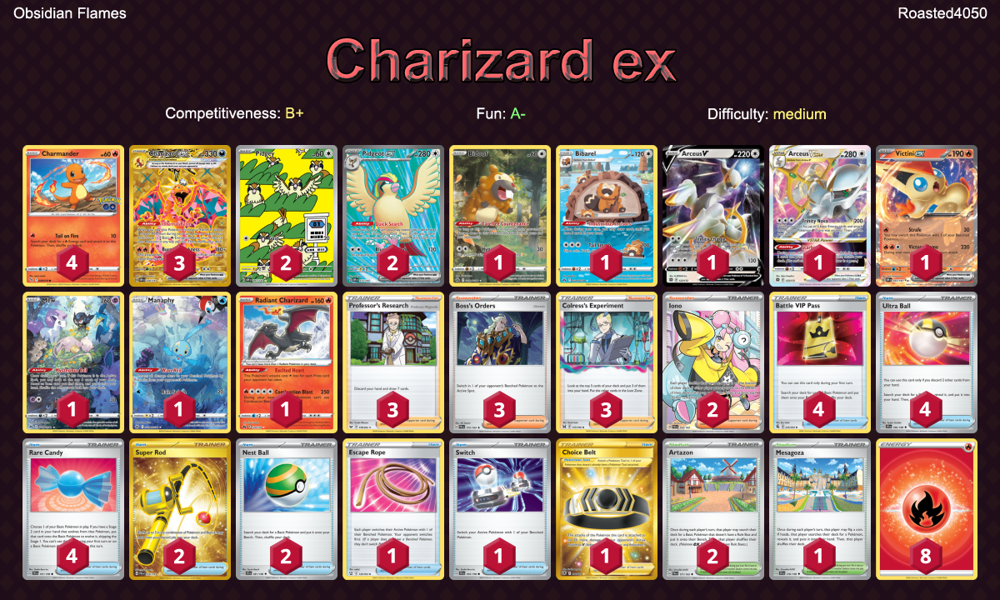

# Charizard/Arceus

## List
* 2 Pidgey OBF 207
* 1 Bidoof CRZ-GG 29
* 1 Victini ex OBF 33
* 1 Mew CRZ-GG 10
* 3 Charizard ex OBF 228
* 1 Manaphy CRZ-GG 6
* 4 Charmander PGO 8
* 1 Arceus VSTAR BRS 123
* 1 Arceus V BRS 122
* 2 Pidgeot ex OBF 217
* 1 Radiant Charizard CRZ 20
* 1 Bibarel CRZ-GG 25
* 2 Iono PAL 254
* 3 Professor's Research SSH 178
* 1 Escape Rope BST 125
* 2 Super Rod PAL 276
* 1 Choice Belt ASR 211
* 1 Mesagoza SVI 178
* 2 Nest Ball SVI 181
* 2 Artazon PAL 171
* 4 Battle VIP Pass FST 225
* 3 Boss's Orders PAL 172
* 3 Colress's Experiment LOR 155
* 4 Ultra Ball SVI 196
* 1 Switch SVI 194
* 4 Rare Candy SVI 191
* 8 Basic {R} Energy Energy 19
