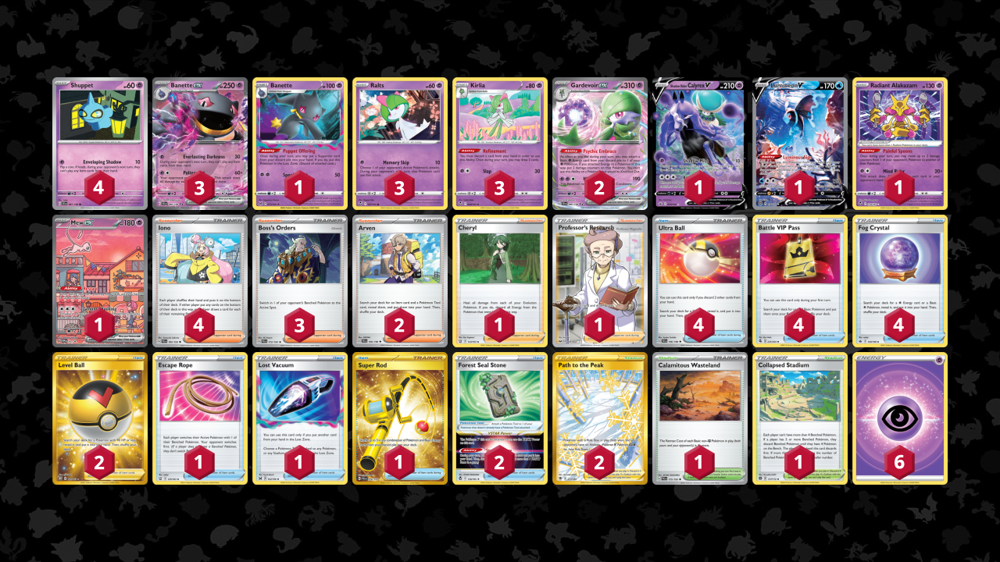

# Banette/Gardevoir

> **Author**: Mateusz Łaszkiewicz
> 
> **Competitiveness:** B- | **Difficulty:** Hard | **Fun:** A-

## List
* 3 Kirlia SIT 68
* 2 Gardevoir ex SVI 86
* 1 Shadow Rider Calyrex V CRE 74
* 1 Banette LOR 73
* 3 Ralts SIT 67
* 4 Shuppet SVI 87
* 1 Lumineon V BRS 156
* 1 Radiant Alakazam SIT 59
* 3 Banette ex SVI 88
* 1 Mew ex PR-SV 53
* 4 Ultra Ball SVI 196
* 1 Cheryl BST 123
* 1 Escape Rope BST 125
* 2 Path to the Peak ASR 213
* 1 Lost Vacuum LOR 162
* 1 Super Rod PAL 276
* 4 Battle VIP Pass FST 225
* 4 Fog Crystal CRE 140
* 4 Iono PAL 185
* 2 Level Ball BST 181
* 2 Forest Seal Stone SIT 156
* 1 Calamitous Wasteland PAL 175
* 1 Collapsed Stadium BRS 137
* 3 Boss's Orders PAL 172
* 2 Arven SVI 166
* 1 Professor's Research SSH 201
* 6 Basic {P} Energy SVE 5
