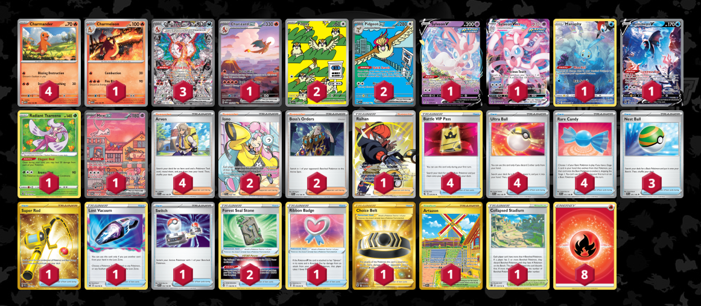

# Charizard/Sylveon

> **Author**: thaDifftcg
> 
> **Competitiveness:** C- | **Difficulty:** Medium | **Fun:** B+

## List
* 4 Charmander MEW 4
* 1 Charmeleon MEW 5
* 2 Pidgey OBF 207
* 2 Pidgeot ex OBF 225
* 3 Charizard ex OBF 223
* 1 Sylveon VMAX EVS 75
* 1 Manaphy CRZ-GG 6
* 1 Lumineon V BRS 156
* 1 Charizard ex MEW 199
* 1 Sylveon V EVS 74
* 1 Radiant Tsareena SIT 16
* 1 Mew ex PR-SV 53
* 1 Raihan SIT-TG 27
* 2 Iono PAL 254
* 1 Ribbon Badge EVS 155
* 1 Super Rod PAL 276
* 1 Artazon OBF 229
* 2 Forest Seal Stone SIT 156
* 1 Choice Belt ASR 211
* 3 Nest Ball SVI 181
* 4 Battle VIP Pass FST 225
* 2 Boss's Orders PAL 172
* 4 Arven SVI 166
* 1 Lost Vacuum LOR 162
* 1 Collapsed Stadium BRS 137
* 4 Ultra Ball SVI 196
* 1 Switch SVI 194
* 4 Rare Candy SVI 191
* 8 Basic {R} Energy SVE 2
