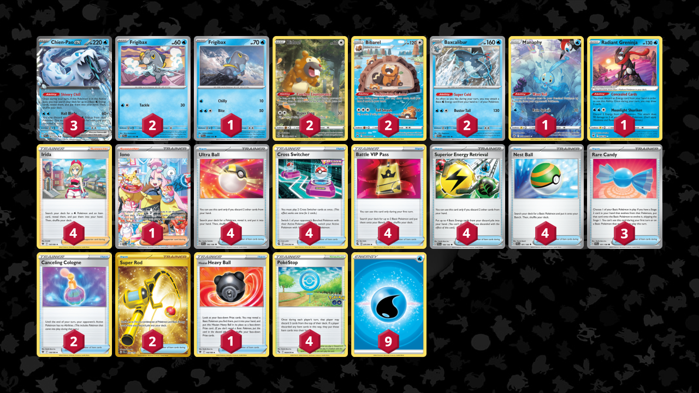

# Chien-Pao/Baxcalibur

> **Author**: Grant Shen & Co
> 
> **Competitiveness:** A- | **Difficulty:** Hard | **Fun:** A

## List
* 1 Manaphy CRZ-GG 6
* 2 Baxcalibur PAL 60
* 1 Frigibax PAL 58
* 2 Bibarel CRZ-GG 25
* 3 Chien-Pao ex PAL 61
* 1 Radiant Greninja ASR 46
* 2 Frigibax PAL 57
* 2 Bidoof CRZ-GG 29
* 4 Ultra Ball SVI 196
* 4 Irida ASR 147
* 3 Rare Candy SVI 191
* 2 Canceling Cologne ASR 136
* 4 Cross Switcher FST 230
* 1 Hisuian Heavy Ball ASR 146
* 2 Super Rod PAL 276
* 4 Battle VIP Pass FST 225
* 1 Iono PAL 269
* 4 PokéStop PGO 68
* 4 Superior Energy Retrieval PAL 189
* 4 Nest Ball SVI 181
* 9 Basic {W} Energy SVE 3
