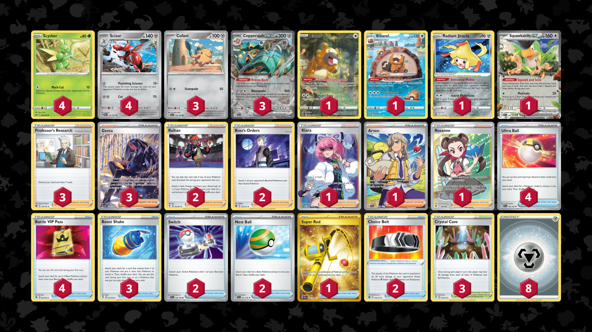

# Copperajah-Scizor

> **Author**: Squack Mcquack
> 
> **Competitiveness:** C- | **Difficulty:** Moderate | **Fun:** A-

## List
* 4 Scyther CRZ 6
* 3 Copperajah ex PAL 150
* 1 Bibarel CRZ-GG 25
* 1 Radiant Jirachi SIT 120
* 4 Scizor OBF 141
* 1 Squawkabilly ex PAL 169
* 1 Bidoof CRZ-GG 29
* 3 Cufant PAL 149
* 3 Professor's Research BRS 147
* 1 Klara PR-SW 302
* 4 Ultra Ball SVI 196
* 2 Raihan EVS 152
* 2 Switch SVI 194
* 1 Arven SVI 235
* 1 Super Rod PAL 276
* 4 Battle VIP Pass FST 225
* 3 Geeta OBF 226
* 3 Boost Shake EVS 142
* 1 Roxanne ASR 188
* 3 Crystal Cave EVS 144
* 2 Nest Ball SVI 181
* 2 Choice Belt BRS 135
* 2 Boss's Orders BRS 132
* 8 Basic {M} Energy Energy 16
