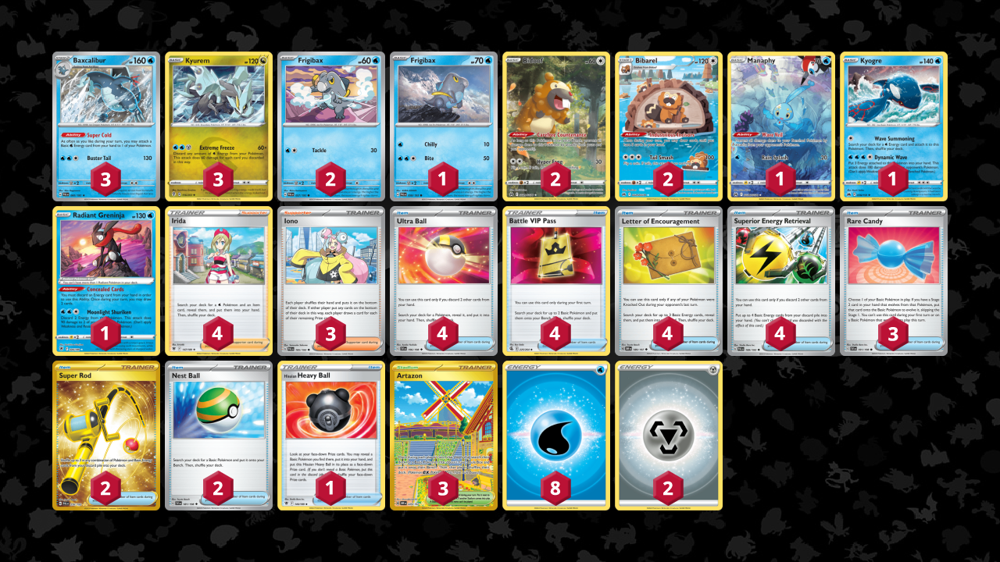

# Kyurem/Baxcalibur

- Author: Azul Garcia Griego
- Competitiveness: C+ | Difficulty: Easy | Fun: A+

## List
* 1 Manaphy CRZ-GG 6
* 3 Baxcalibur PAL 60
* 1 Frigibax PAL 58
* 1 Kyogre CRZ 36
* 2 Bibarel CRZ-GG 25
* 3 Kyurem EVS 116
* 1 Radiant Greninja ASR 46
* 2 Frigibax PAL 57
* 2 Bidoof CRZ-GG 29
* 4 Ultra Ball SVI 196
* 4 Irida ASR 147
* 3 Rare Candy SVI 191
* 1 Hisuian Heavy Ball ASR 146
* 2 Super Rod PAL 276
* 4 Battle VIP Pass FST 225
* 4 Letter of Encouragement OBF 189
* 3 Iono PAL 185
* 4 Superior Energy Retrieval PAL 189
* 3 Artazon OBF 229
* 2 Nest Ball SVI 181
* 2 Basic {M} Energy Energy 16
* 8 Basic {W} Energy Energy 11
