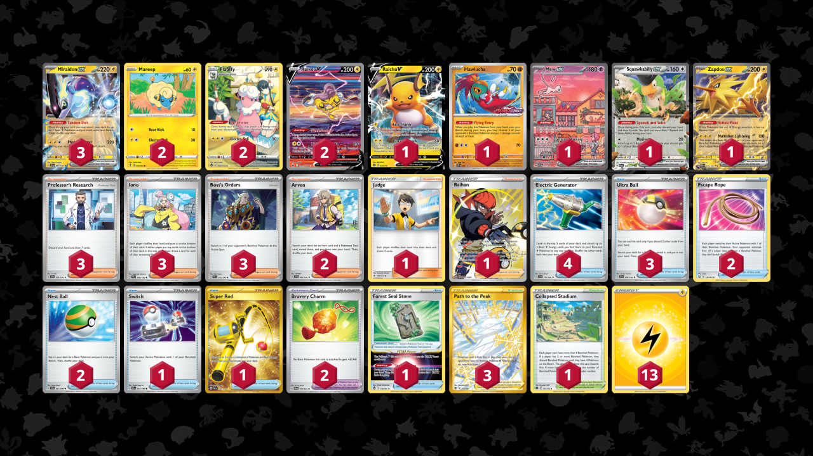

# Miraidon/Flaaffy

> **Author**: Kyohei Uchida
> 
> **Competitiveness:** A | **Difficulty:** Medium | **Fun:** A-

## List
* 2 Raikou V CRZ-GG 41
* 2 Flaaffy SIT-TG 3
* 1 Raichu V BRS 45
* 3 Miraidon ex SVI 81
* 1 Hawlucha PR-SV 7
* 2 Mareep EVS 54
* 1 Mew ex PR-SV 53
* 1 Squawkabilly ex PAL 169
* 1 Zapdos ex MEW 145
* 1 Judge FLI 108
* 3 Ultra Ball SVI 196
* 1 Switch SVI 194
* 3 Professor's Research SVI 190
* 2 Escape Rope BST 125
* 4 Electric Generator SVI 170
* 3 Path to the Peak ASR 213
* 1 Super Rod PAL 276
* 3 Iono PAL 185
* 1 Forest Seal Stone SIT 156
* 2 Nest Ball SVI 181
* 1 Raihan SIT-TG 27
* 1 Collapsed Stadium BRS 137
* 2 Bravery Charm PAL 173
* 3 Boss's Orders PAL 172
* 2 Arven SVI 166
* 13 Basic {L} Energy Energy 21
